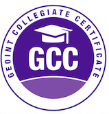

# 🌍 Hey, I’m Daniel Soares! 

### 🗺️ Geospatial Data Scientist | Remote Sensing & GeoAI Specialist | GEOINT Professional | PhD candidate Researcher

---

**IMPORTANT (Português)**
> 🔴 **Para Atuação Forense e Perícias Judiciais (Brasil):** [Acesse o Portfólio em Português aqui](README_PT.md)

---

- [ORCID](https://orcid.org/0000-0002-8582-0854)
- [GitHub](https://github.com/ddosoares)
- [LinkedIn](https://www.linkedin.com/in/daniel-dosoares/)

---

## 🔬 About Me

I am a geospatial researcher and data scientist focused on land use and land cover mapping. I combine **Geosciences**, **Remote Sensing**, and **Machine Learning** to turn complex satellite imagery and spatial datasets into actionable insights and automated workflows for environmental decision-making.

- 🎓 **PhD Candidate** in Applied Geosciences at Geosciences Institute - University of Brasília.
- 🎓 **M.Sc.** in Science and Geographic Information Systems at NOVA IMS - University NOVA of Lisbon.
- 🎓 **B.Sc.** in Geography at IESA - Federal University of Goiás.
- 🎓 **Tecgo.** in Geoprocessing at the Federal Institute of Goiás.
- 🔬 **Current Focus:** Developing a doctoral thesis funded by CNPq using Vision-Language Models (VLM), Deep Learning, and Remote Sensing to map the Cerrado biome.
- 💡 **Core Interests:** Deep Learning for Earth Observation (GeoAI), Land Use/Cover Classifications (LULC), Spatial Analytics, and Big Spatial Data.

---

## 🛠️ Technical Stack & Tools

- **Geospatial & Remote Sensing:** QGIS, Google Earth Engine, ArcGIS, PostGIS
- **Data Science & AI:** Python, SQL, Scikit-Learn, Power BI
- **Expertise Keywords:** Spatial Analysis, GeoAI, Image Processing, LULC Mapping, Vision-Language Models (VLM), Spatial Databases

---

## 🚀 Highlighted Professional Journey

- **CNPq** Brazil | *Researcher* (Aug 2025 - Present) — Deep Learning and GIS pipeline development for the Cerrado biome.
- **INPE** Brazil | *Scientific Researcher* (Jul 2024 - Mar 2025) — Earth Observation and methodology development.
- **Accenture** Portugal | *Data Analyst* (May 2023 - Nov 2023) — Data engineering, analytics pipelines, and collection.
- **Finsolutia** Portugal | *Junior Software Developer* (Oct 2022 - Apr 2023) — Python, SQL, and Power BI automation.
- **DGT Portugal** Portugal | *Geographer & Photointerpreter* (Jul 2018 - Dec 2019) — Spatial data production and analysis.
- **LAPIG (UFG)**  Brazil| *GIS Analyst* (May 2013 - Jun 2017) — Image processing remote sensing and GIS laboratory workflows.

---

## 📚 Selected Publications & Certifications

### 📝 Main Key Publications
1. *Methodology of historical Land Cover and Land Use mapping of Brazilian Savannah between 1975 and 2010.*
2. *Development of Methodologies for Monitoring Civil Works through Brazilian Satellite Images.* (Presented at XXI SBSR, 2025)
3. *GEOINT evaluation of risk index for police deaths in service in the Rio de Janeiro city, Brazil.*
4. *Identification of Development Poles on Brazilian Amazon Region and Analysis of the Geographic Accessibility.*
5. *Dynamics of active fire data and their relationship with fires in the areas of regularized indigenous lands in the Southern Amazon.*
6. *Adaptation of the Corine Land Cover Methodology to TerraClass Cerrado for Land Use and Land Cover analysis in the Cerrado: Case study in Cristalina, Goiás.*

### 🏅 Certifications & Awards
- **GEOINT Collegiate Certificate (GCC)** issued by United States Geospatial Intelligence Foundation (USGIF) [GEOINT Badge Certification](https://bcert.me/scpdzrcoy)
- **Best Poster Award** issued by XII Simpósio Brasileiro de Sensoriamento Remoto 2005 (SBSR)

---

## 📬 Contact Me

- 📧 Email: **ddosoares@gmail.com**
- 📍 Based in: **Brasília, DF, Brazil**
- 💬 Let's collaborate on **GeoAI, Remote Sensing applications, or Python-driven Spatial Analytics** workflows!
